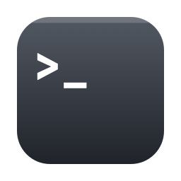

<p align="center">
  
</p>

<h1 align="center">Go2Term</h1>

<p align="center">
  Open the current Finder folder in your terminal, from a Finder toolbar button.<br>
  A native Apple Silicon replacement for Go2Shell on macOS 26+, where Intel-only apps no longer run.
</p>

---

[English](#english) | [中文](#中文)

## English

### Features

- **One click** on the Finder toolbar icon opens the current folder in your terminal
- **One-click install** — no manual toolbar dragging; Go2Term writes itself into the Finder toolbar (this is reverse-engineered from Finder's native toolbar storage format, see [How it works](#how-it-works))
- Supports **iTerm2, Terminal, Warp, Ghostty, kitty, Alacritty** (auto-detected)
- Native **arm64**, ~100 KB, no background process — launches, opens your terminal, quits
- English / 简体中文 (follows system language)

### Install

1. Download the `.dmg` from [Releases](../../releases), drag **Go2Term** to **Applications**
2. Open Go2Term. macOS will warn that the app is from an unidentified source (it is signed but not yet notarized) — allow it via **System Settings → Privacy & Security → Open Anyway**
3. Click **Install to Finder Toolbar**. Finder relaunches with the icon in place
4. First click on the icon: approve the *"Go2Term wants to control Finder"* prompt (one time only — it's how Go2Term reads the current folder)

### Usage

| Action | How |
|---|---|
| Open terminal at current folder | Click the toolbar icon |
| Settings window (choose terminal, install/remove) | Hold **⌥** and open Go2Term, or `open -a Go2Term --args config` |
| Change terminal from CLI | `defaults write com.panbo.Go2Term TerminalApp Terminal` |
| Install / uninstall from CLI | `open -a Go2Term --args install` / `--args uninstall` |

### How it works

- The current folder is read from Finder via Apple Events (`insertion location`), then opened with `open -a <terminal> <path>`.
- One-click install writes Finder's toolbar preferences directly (`com.apple.finder` → `NSToolbar Configuration Browser`). Third-party toolbar items are identified as `com.apple.finder.loc` (plus trailing spaces for uniqueness) in `TB Item Identifiers`, with their location stored in `TB Item Plists` — keyed by the item's **array index**, as `{_CFURLAliasData, _CFURLString, _CFURLStringType}`. Go2Term writes modern bookmark data there; Finder accepts it and normalizes it to an alias record on load. Finder is then relaunched.

### Build from source

```sh
./build.sh        # requires Xcode command line tools
ditto build/Go2Term.app /Applications/Go2Term.app
```

Signing identity is set at the top of `build.sh` — replace it with your own (or use `--sign -` for ad-hoc).

---

## 中文

### 特性

- 点一下 Finder 工具栏图标，就在终端打开当前目录
- **真·一键安装**——不用手动拖工具栏，Go2Term 直接把自己写进 Finder 工具栏配置（逆向了 Finder 原生存储格式，见上方 How it works）
- 支持 **iTerm2、Terminal、Warp、Ghostty、kitty、Alacritty**（自动检测）
- 原生 **arm64**，约 100 KB，无常驻进程——启动、开终端、退出
- 中英文界面（跟随系统语言）

### 安装

1. 从 [Releases](../../releases) 下载 `.dmg`，把 **Go2Term** 拖到 **应用程序**
2. 打开 Go2Term。因为暂未公证，macOS 会提示来源不明——去 **系统设置 → 隐私与安全性 → 仍要打开**
3. 点 **「一键安装到 Finder 工具栏」**，Finder 重启后图标就位
4. 第一次点图标时，允许 *「Go2Term 想要控制 Finder」* 的授权（仅一次，用于读取当前目录）

### 使用

| 操作 | 方法 |
|---|---|
| 在终端打开当前目录 | 点工具栏图标 |
| 设置窗口（选终端、安装/移除） | 按住 **⌥** 打开 Go2Term，或 `open -a Go2Term --args config` |
| 命令行换终端 | `defaults write com.panbo.Go2Term TerminalApp Terminal` |
| 命令行安装/卸载 | `open -a Go2Term --args install` / `--args uninstall` |

## License

[MIT](LICENSE)
